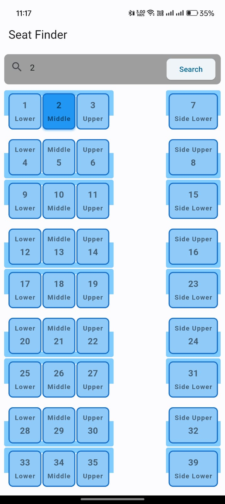
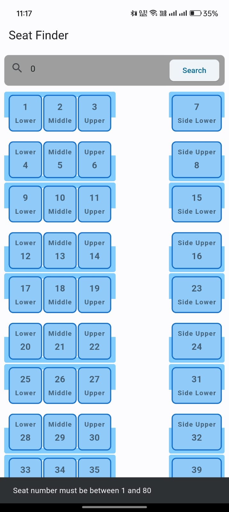
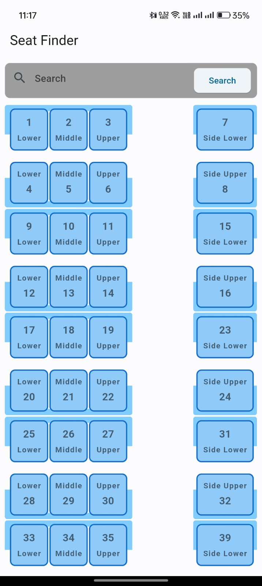

# Seat Finder App

This is a Flutter application that helps users identify the location and type of berth based on a given seat number in Indian trains.

## Features

- Seat Number Input: Users can enter a seat number to find its location and type of berth.
- Berth Identification: The app will display the location and type of berth corresponding to the entered seat number.
- Seat Map: Users can view a seat map to get an overview of the different types of berths in the train.
- AutoScroll: The app automatically scrolls to the row of the seat entered and highilights the searched seat.

## Screenshots

## Getting Started

To get started with the Seat Finder app, follow these steps:

1. Clone the repository: `git clone https://github.com/Mittal-Sudhanshu/seat_finding_app.git`
2. Navigate to the project directory: `cd seat-finder-app`
3. Install dependencies: `flutter pub get`
4. Run the app: `flutter run`

## Dependencies

The following dependencies are used in this project:

- [flutter](https://flutter.dev)
- [flutter_screenutil](https://pub.dev/packages/flutter_screenutil) ^5.9.0
